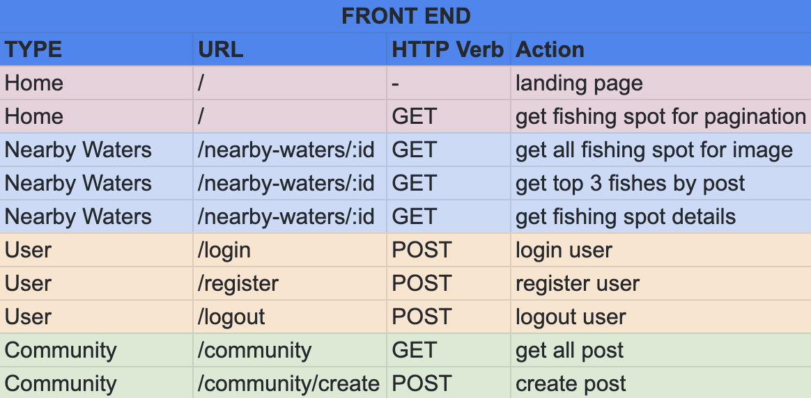
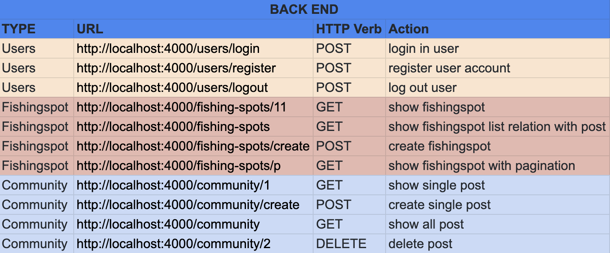
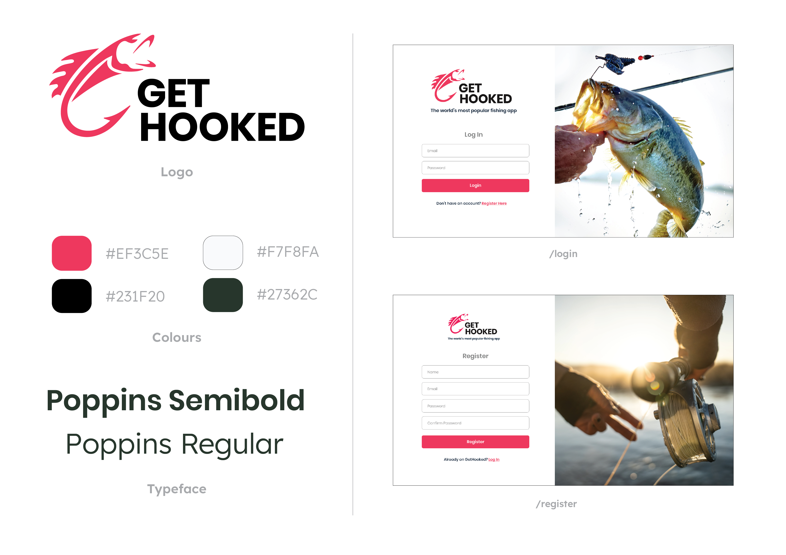
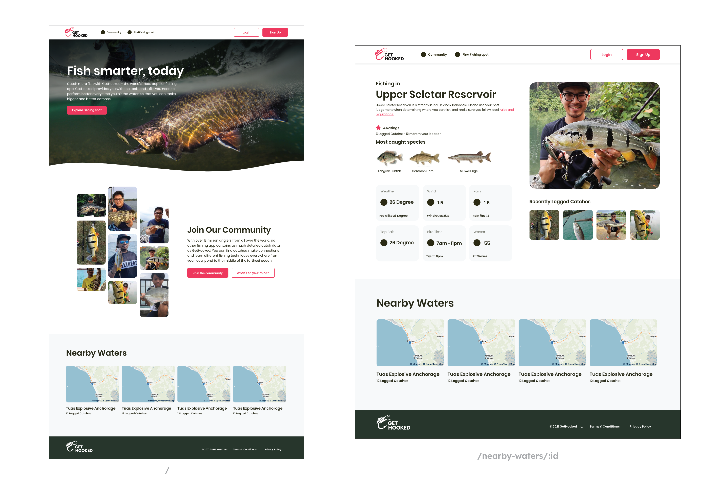
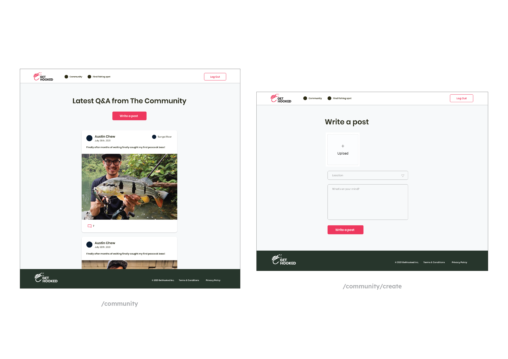

  

<h1>GetHooked</h1>

OBJECTIVE: <a href="http://gethooked-fe.herokuapp.com/">GetHooked</a> is an App that allows angler to record catches, share with people with similar hobby — which is tag to the specific Fishing hotspots. GetHooked allows angler to upload their fresh catch images to the community platform to "Brag their catches". It also empowers angler with the knowledge to figure out where are the hot bites and the most caught fishes in that specific fishing spot.

WHO WILL USE THIS: Angler, People with fishing as a hobby, fishing community.
 

#

<h2> Application Features </h2>
1. Login page 
2. Register Page 
3. Homepage — introduction 
4. Nearby Waters page 
5. Community post  

 
<h2>Technologies used</h2>
- Authorization 
- Typeorm SQL 
- NestJS typescript 
- Bcrypt 
- Toastify 
- Material UI 
- AXIOS 
- CORS 
- DOTENV 
- React 
- JSON Web Token 
 

<h2>Routes / Pages</h2>
<h3>Front End:</h3>

  
<h3>Back End:</h3>

 
 
<h2>The Approaches Taken</h2>
1. Research on best practices & competitor analysis 
2. Research on design inspirations  
3. App Name Exploration  
4. Wireframe / Design mock up & logo design 
5. Determine the routes and data needed 
6. Set up database with Typeorm SQL 
7. Concurrently working on Front User Interface & Back End  Routes  
8. Deploying Backend on Heroku and Postman 
9. Deploying Front End onto Heroku 
 
 

<h2>Initial Wireframe & Design</h2>

  
<h2>Unsolved Problems</h2>
1. Fishing Spot Page (Google Map) 
2. Nearby Water page: Fishing spot specs 
3. Nearby Water page: Ratings 
4. Community Post: Upload image to cloudinary 
 

<h2>Note to self</h2>
1. Further improve on app features e.g. Google Map, upload image to cloudinary  

 

<h2>Application Front / Back End Deployed on Heroku</h2>
1. <a href ="https://teamup-fe.herokuapp.com/">GetHooked Font End
 </a> 
 

<h2>Github Repositories</h2>
1. <a href ="https://github.com/lucasseet/gethooked-fe">Front-End Repo
 </a> 
2. <a href ="https://github.com/lucasseet/gethooked-be">Back-End Repo
 </a> 
